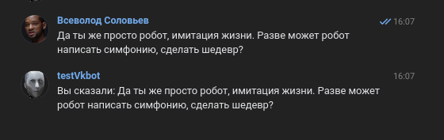
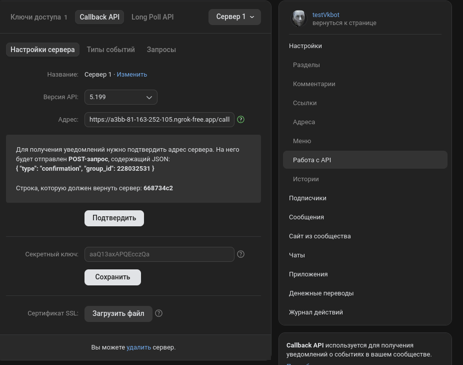

## Test Task by JustAi

---
### Dev Comment
> Ну, рабочий код, Без security, валидации security secret, и без модульных тестов. Так что главную цель код выполняет, но в остальном вряд ли уйдет далеко. \
> Уж больно много времени ушло на настройку бота на стороне VK, ибо делаю бота на этой платформе я впервые. \
> Приложу результат работы. 



---
### Get Started

#### Instruction for Linux

- **Download Project**
   + Пропишите GitClone данного проекта;
- **Ngrok Usage**
   + Зарегистрируйтесь в `Ngrok` через VPN и получите `AuthToken`;
   + Зайдите в папку `/<your-path-to-project>/vkbot/`
   + Создайте в этом пути файл `.env` с текстом:
  ```.env
  # ------------- NGROK -------------
  NGROK_TOKEN=<Your-Auth_Token>
  # ------------- VK -------------
  VK_AUTH_TOKEN=
  VK_CONFIRMATION_CODE=
  VK_API_VERSION=5.199
  ```
   + Находясь в папке `vkbot` пропишите команду `docker compose up --build ngrok`;
   + Затем для просмотра логов прописывает `docker compose logs -f ngrok`;
   + Высматривайте ссылку на вашу страницу в Ngrok. Она переадресует вас на страницу с вашими Агентами. (можете и просто зайти через сайт Ngrok и посмотреть вкладку `Universal Gateway/Endpoints`);
   + Сохраняйте URL который прописан в endpoints;

- **Vk Bot Creation**
   + Создайте сообщество;
   + Заходим Управление/Настройки/Работа с API;
   + Выбирайте `CallBackAPI`;
   
   
   + Выбираете Версию API `5.199`;
   + В `Адрес:` прописывайте URL который вы взяли из Ngrok Endpoints + допишите `/callback`. Т.е. url должен быть таким: `https://a3bb-81-163-252-105.ngrok-free.app/callback`;
   + Заходите затем во вкладку `Ключи доступа` и генерируете `Access_Token`;
   + Затем заходите в Управление/Сообщения. Включите `Сообщения Сообщества: Включены`;
   + Также там же заходите во вкладку `Настройки для бота` и ставить во всех checkboxes галки;
   + Создаете чат, и в нем же включаете бота, чтобы Callback API начал свою работу;

- **Boot VkBot API**
   + Заходите в проект по пути `/<your-path-to-project>/vkbot/` и прописываете в терминале команду `mvn clean package`;
   + Создайте файл `.env` с параметрами которые вы получили на прошлых пунктах и запустите весь docker кластер;
    ```.env
    # ------------- NGROK -------------
   NGROK_TOKEN=<Your-Auth_Token>
   # ------------- VK -------------
   VK_ACCESS_TOKEN=<YOUR_ACCESS_TOKEN>
   VK_CONFIRMATION_CODE=<YOUR_CONFIRMATION_CODE>
   VK_API_VERSION=5.199
    ```
   + Прописываете команду `docker compose up --build`;
   + По логам смотрите выполнение кода;

### Sources

[Description of task](doc/task/task.md)

[My_Bot](https://vk.com/club228032531)
