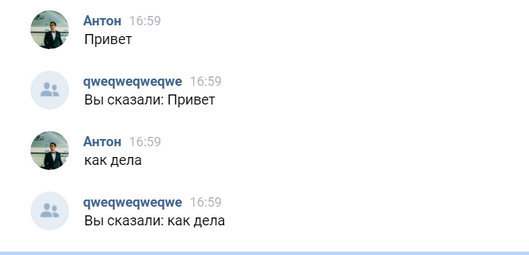

## JustAi JavaDeveloper test task

---

### Task:


```doc
Необходимо выполнить интеграцию с BotAPI VK. https://vk.com/dev/bots_docs

В рамках задания нужно создать бота который будет цитировать присланный ему текст. Пример взаимодействия с подобным ботом см. на картинке:
```


```
Минимальные требования к реализации

Нужно приложить ссылку на git репозиторий с исходниками
Реализация должна быть на языке Kotlin или Java. Использование Kotlin будет преимуществом, но не является обязательным
Должен использоваться фреймворк Spring Boot
Нельзя использовать готовые библиотеки для реализации VkApi


Все остальные критерии (такие как структура кода, покрытие тестами, конфигурация, документация и др) являются опциональными, но будут также оцениваться

При реализации может потребоваться использование внешних https адресов для локальной машины. Для этого можно использовать ngrok.
```

